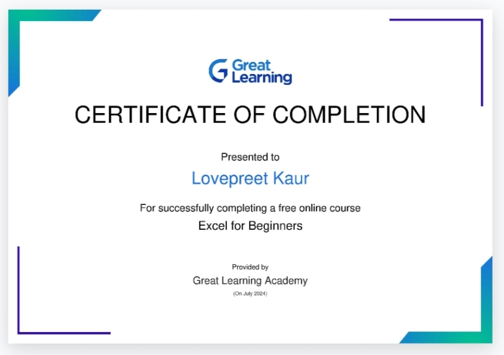

# 1234567-debug.github.io
This is my first GitHub page

###my experience at gndec college

Firstly i indtroduce my self so my name is lovepreet kaur . I have to passed my 12th from Meritorious school ferozpur with 94 % in non medical stream.now i studying in gndec college ludhiana .I go to know about this college from trakki foundation.I pursue b.tech in IT in this college.I share my experience in gndec day by day so lets start.

#Day-1

Firstly at gndec we visited at gurdwara sahib for inaugration ceremony .After kirtan and ardaas they provide us tea and sweets.after that we were go to auditorium.There we met many faculty members.Mrs.gurleen kaur an IPS officer at delhi came to our collage and gave us huge round of knowledge.she told us about his struggle life and too much more.on that day we enjoy too much . It is a very wonderful experience for me .

##Day-2

on the second day of induction programme we were in classes .our Ist class is universal human value class which is host by professor jasmine kaur mam .she told us about human aspiration and human desires and about natural acceptance .she told us only phsical facilities is not sufficient for happiness and fulfillment of relationship is also necessary.Our second class is host by our seniors they learn us about excel and chat gpt .It is also very good experience for me.
my online course certificate 

